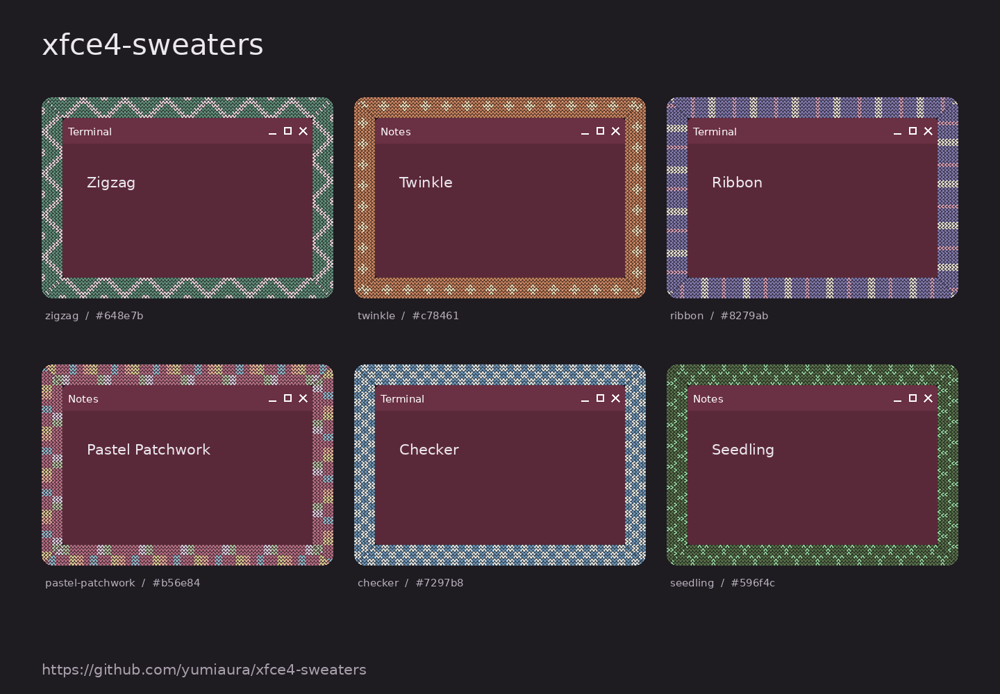

# XFCE4 Sweaters

Knitted borders for XFCE4 windows on Linux. Every window gets its own
pattern: random by default, or one you choose.

**0.0.0, first experimental release. XFCE4 / Xfwm4, X11, compositor
enabled. Wayland is not supported.**



The image shows real pattern renders around placeholder window contents.
It illustrates the textures; it is not a screenshot of a running XFCE session.

## Features

- 47 built-in knitting charts: stripes, zigzags, checks, cables, floral
  motifs and colour palettes.
- A random pattern and colour for every window by default. The choice does
  not change on focus, move, minimize or workspace switch.
- A "Shuffle" button for a fresh set of random combinations.
- Global pattern, main colour, border width, stitch size and opacity of
  inactive borders.
- Per-window settings that last until that window is closed.
- Persistent rules by `WM_CLASS` and, optionally, window title.
- Your own PNG textures, and the ability to turn the border off selectively.
- GTK settings window, XFCE panel icon, optional autostart.

The border sits **outside** the regular window frame, including the title
bar. It does not replace the Xfwm4 theme and does not alter application
contents. A transparent centre and an empty input area let you click and
resize windows as usual. Stacking is tied to each window: the border of a
lower window stays below any window that overlaps it.

## Installation: Ubuntu 24.04 / Xubuntu

Run the commands in a terminal inside your graphical XFCE session:

```bash
sudo apt update
sudo apt install python3-gi python3-gi-cairo python3-cairo python3-pil python3-xlib gir1.2-gtk-3.0
/usr/bin/python3 scripts/install.py --autostart
~/.local/bin/xfce4-sweaters settings
```

Without `--autostart` the application is started manually only. The install
is per-user: no `sudo`, no virtual environment and no packages downloaded
through pip. Other distributions need the equivalent GTK3, PyGObject,
pycairo, Pillow and python-xlib packages.

### APT repository

The project runs its own APT repository at
<https://yumiaura.github.io/xfce4-sweaters/>. It is rebuilt by CI on every
release and signed with the key `5C4F 1331 F4E3 ED1F 7998 C19A 2EBF C7F4 FB5D B182`.
Add it once:

```bash
sudo curl -fsSL -o /usr/share/keyrings/xfce4-sweaters.gpg https://yumiaura.github.io/xfce4-sweaters/xfce4-sweaters.gpg
echo 'deb [signed-by=/usr/share/keyrings/xfce4-sweaters.gpg] https://yumiaura.github.io/xfce4-sweaters ./' | sudo tee /etc/apt/sources.list.d/xfce4-sweaters.list
sudo apt update && sudo apt install xfce4-sweaters
```

From then on `sudo apt upgrade` picks up new releases together with the
rest of the system. The package installs the command, the menu entry and
an XFCE autostart entry; apt pulls the runtime dependencies.

To remove the repository, delete `/etc/apt/sources.list.d/xfce4-sweaters.list`
and `/usr/share/keyrings/xfce4-sweaters.gpg`.

### Debian package

Without the repository, the latest `.deb` is always at the same address:

```bash
wget https://github.com/yumiaura/xfce4-sweaters/releases/latest/download/xfce4-sweaters_all.deb
sudo apt install ./xfce4-sweaters_all.deb
```

It is the same package the repository serves, just without automatic updates.

### PyPI

`pip install xfce4-sweaters` installs the package and the `xfce4-sweaters`
command. PyGObject and pycairo still come from the apt packages above, and
pip creates no menu or autostart entry.

In XFCE enable **Settings → Window Manager Tweaks → Compositor → Enable
display compositing**.

If the command is not found, use the full path `~/.local/bin/xfce4-sweaters`.
The application also appears in the XFCE menu. Left-click the panel icon to
open the settings; right-click for the pause, shuffle and quit menu.

## Choosing a texture

Open the **Appearance** tab, pick a pattern or "Random" and click **Apply**.
The colour field accepts `random` or `#RRGGBB`. The colour changes the main
yarn; the extra colours of a motif are stored in the chart.

On the **Windows and applications** tab:

1. Refresh the list and pick the open window you want.
2. Choose a pattern and colour.
3. Click **This window only** for a temporary choice, or **Save rule for
   application** to keep it across restarts.

The title filter supports `*` and `?`, for example `*project*`. Saved rules
are applied top to bottom: the first match wins. A temporary per-window
setting takes priority over rules. Resetting the temporary setting returns
the window to the rules and global settings. Saved rules can be removed in
the same window.

New windows get their own random choice; after closing and reopening it may
change. To style an application permanently, save a specific pattern.
Shuffling only affects settings whose value is `random`.

## Your own textures

Click **Add PNG**. File name: Latin letters, digits, `_`, `-`; maximum image
size 1024 × 1024. The file becomes a seamlessly repeating texture that is
also available for random selection. Transparency is preserved. A small
32 × 32 or 64 × 64 tile is a good starting point.

A PNG is repeated at its original size, with no recolouring and no change of
stitch size. Colour and stitch size apply to the built-in knitting charts.

Custom PNGs live in `~/.local/share/xfce4-sweaters/textures/`
(`XDG_DATA_HOME` is respected). After adding files by hand, restart the
application. Do not delete a PNG that the active configuration refers to:
change the rule first.

## Configuration

File: `~/.config/xfce4-sweaters/config.json` (`XDG_CONFIG_HOME` is
respected). It is created the first time settings are saved. Until then the
built-in defaults apply:

```json
{
  "version": 1,
  "enabled": true,
  "texture": "random",
  "color": "random",
  "width": 24,
  "stitch": 5,
  "inactive_opacity": 0.8,
  "hide_maximized": true,
  "seed": 0,
  "rules": []
}
```

Example `rules` entries:

```json
[
  {"wm_class": "Firefox", "title": "*Work*", "texture": "zigzag", "color": "#648e7b"},
  {"wm_class": "Xfce4-terminal", "texture": "ribbon", "color": "#8279ab", "width": 28},
  {"wm_class": "Code", "texture": "user:my-knit"},
  {"wm_class": "mpv", "texture": "off"}
]
```

The `user:my-knit` example requires an imported `my-knit.png`. Rules use
case-insensitive glob patterns, not regular expressions. Find the exact
`WM_CLASS` with `xprop WM_CLASS` and a click on the window.

JSON changes are picked up automatically. On an error the running process
keeps the last valid configuration and writes the reason to stderr.

## Command line

```bash
xfce4-sweaters run                 # borders and panel icon
xfce4-sweaters settings            # open settings without a second process
xfce4-sweaters list-textures
xfce4-sweaters check-config
xfce4-sweaters preview border.png --texture zigzag --color '#648e7b'
xfce4-sweaters --config /path/config.json run
```

When running from the source tree, replace `xfce4-sweaters` with
`/usr/bin/python3 -m xfce4_sweaters`. The `preview`, `list-textures` and
`check-config` commands do not need a graphical session, only Pillow.

## Limitations of the first release

- X11 only: XWayland inside a Wayland session is not supported.
- A running compositor is required. When it is turned off the borders are hidden.
- Fullscreen, minimized and shaded windows are not decorated. Maximized
  windows are excluded by default; this option can be turned off.
- Borders beyond the screen edge are clipped; the application does not move
  windows to make room. Truly non-rectangular windows are not handled yet.
- Coordinates and width are in physical pixels. Inside the application
  `GDK_SCALE=1` is forced; for HiDPI increase the width/stitch size.
  Monitors with different scale factors need separate verification.
- Window events are processed at intervals of up to 33 ms, with a fallback
  reconciliation once per second. A slight visual lag is possible during
  fast window moves.
- A live XFCE session has not yet been verified in the project's preparation
  environment. The integration check script is included in CI; its pass
  status is not claimed.

## Development and verification

```bash
/usr/bin/python3 -m unittest discover -s tests -v
/usr/bin/python3 scripts/gallery.py
```

The integration test and manual verification are described in
[docs/TESTING.md](docs/TESTING.md). The architecture is described in
[docs/ARCHITECTURE.md](docs/ARCHITECTURE.md).

## Uninstall

Quit the application through the panel icon first:

```bash
/usr/bin/python3 scripts/uninstall.py
```

Settings and your PNGs stay in place.

## License

GPL-3.0-only. Full text in [LICENSE](LICENSE).
